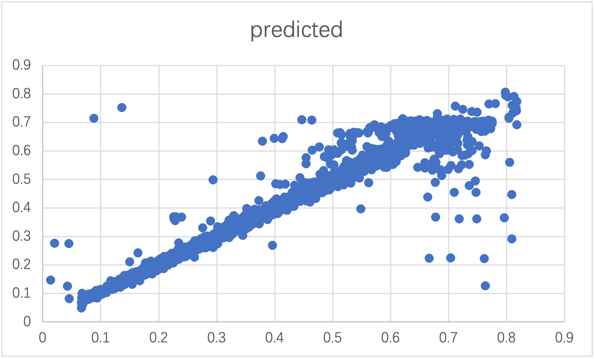
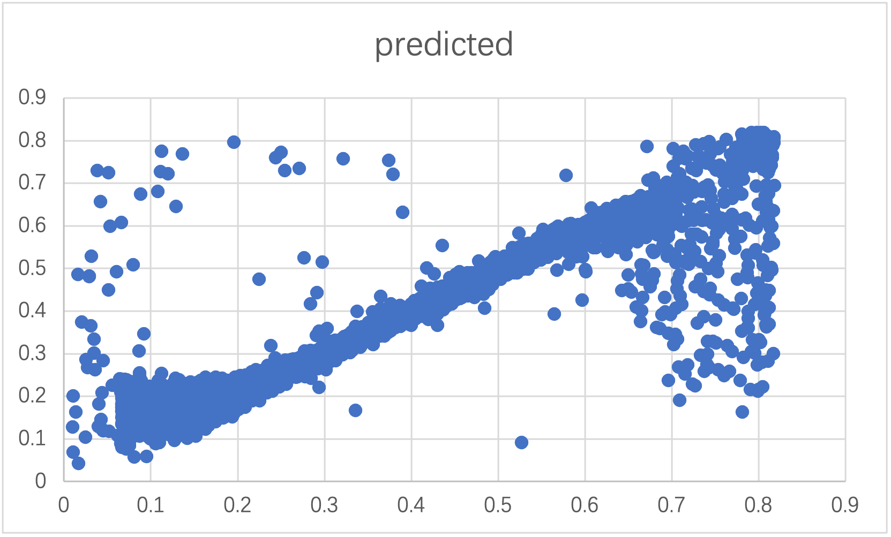

## Validating non-canonical peptides with DeepRT

We use the result of the PXD014145 project filtered by spectrumAI (removing low confident mutations), the resulting file can be found in the following link:

https://github.com/ypriverol/quantms-research/raw/main/proteogenomics-research/deepLC/vali_out.tsv.gz

### Handling modifications in peptide sequences
In order to conform to the input format of DeepRT, we formatted this file, mainly obtaining sequence and RT columns. We need to change the amino acid modification in the peptide sequence to different numbers for subsequent model training and prediction.

For modification purposes of the project, three fixed amino acid modifications "C(Carbamidomethyl)", "K(TMT6plex)","M(Oxidation)" are defined as" 1 "," 2 "," 3 ". For modifications at both ends of the peptide, each amino acid and modification cannot be defined as a single number, since they can occur on each amino acid. So we have two options to deal with these modifications, these are referred to as Methods 1 and Methods 2:

**Methods 1**: Ignore amino acid modifications at both ends. The code logic is as follows：

```python
s = s.replace("C(Carbamidomethyl)","1").replace("K(TMT6plex)","2").replace("M(Oxidation)","3").replace(".(Acetyl)","").replace(".(TMT6plex)","").replace("(TMT6plex)","")
```

**Methods 2**: It just converts the modification to a number and doesn't care which amino acid it's on. ".(Acetyl)",".(TMT6plex)" ,"(TMT6plex)" are defined as " 4 "," 5 "," 6 ".The code logic is as follows:

```python
s = s.replace("C(Carbamidomethyl)","1").replace("K(TMT6plex)","2").replace("M(Oxidation)","3").replace(".(Acetyl)","4").replace(".(TMT6plex)","5").replace("(TMT6plex)","6")
```

**First question is this approach correct or not to handle more than 3 modifications?** 

### Training and prediction sets 

There are two ways to validate them：

1. One is to press canonical peptide 9:1. Divide the training set and test set into two parts to check the prediction effect of the test set. `The segmentation strategy is DeepRT's official segmentation strategy`.

2. The other is to use all canonical peptides to train the model, and then use all canonical peptides to predict again, that is, both the training set and the test set are all canonical peptides. In order to improve accuracy, we will select one of the repeated peptides whose actual value is closest to the predicted value and keep it, discard the others, and then re-predict the model.

We draw scatter plots of actual and predicted values to observe the effect.

1. The training set was 9 and the test set was 1：

     Methods 1

     Methods 2

2. The training set and test set are all canonical peptides：

     Methods 1 (Before removing the redundant peptide)
    
     Methods 2 (Before removing the redundant peptide)
    
     Methods 1 (After removing the redundant peptide) 
    
     Methods 2 (After removing the redundant peptide)
        